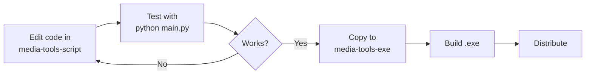

# 📁 Folder Structure Guide

## 🗂️ Project Organization

Project ini terbagi menjadi beberapa folder dengan tujuan berbeda:

### 1. **Tools Folders** (Original)
Folder-folder asli untuk masing-masing tool:

```
├── audio-merger/
├── media-codec-detector/
├── yt-batch-downloader/
├── yt-playlist-downloader/
├── socmed-downloader/
└── media-looper/
```

**Tujuan:** 
- Repository utama untuk source code
- Dokumentasi individual per tool
- Testing individual tool

**Cara pakai:**
```bash
cd audio-merger
python audio_merger_gui.py
```

---

### 2. **media-tools-script/** 🔧 (Development)
Versi unified **untuk development dan debugging**:

```
media-tools-script/
├── main.py              # Launcher terpadu
├── run.bat              # Quick launcher
├── tools/              # All tools in one place
└── README.md           # Dev guide
```

**Tujuan:**
- ✅ Development & debugging
- ✅ Fast iteration (instant run)
- ✅ Easy testing
- ✅ Full error messages

**Cara pakai:**
```bash
cd media-tools-script
run.bat
# atau
python main.py
```

---

### 3. **media-tools-exe/** 📦 (Distribution)
Versi unified **untuk build executable**:

```
media-tools-exe/
├── MediaToolsZakkutsu.spec
├── build.bat           # Build executable
├── main.py
├── tools/
└── dist/
    └── MediaToolsZakkutsu.exe  # Output
```

**Tujuan:**
- ✅ Build single .exe file
- ✅ Distribution to end users
- ✅ GitHub Releases
- ✅ No Python needed

**Cara pakai:**
```bash
cd media-tools-exe
build.bat
# Test: dist\MediaToolsZakkutsu.exe
```

---

## 🔄 Workflow

### Development Workflow



### Step by Step

1. **Development** di `media-tools-script/`:
   ```bash
   cd media-tools-script
   # Edit tools/audio_merger.py
   python main.py  # Test instantly
   ```

2. **Sync to exe version**:
   ```bash
   cp media-tools-script/tools/audio_merger.py media-tools-exe/tools/
   ```

3. **Build executable**:
   ```bash
   cd media-tools-exe
   build.bat
   ```

4. **Test & distribute**:
   ```bash
   dist\MediaToolsZakkutsu.exe
   ```

---

## 🎯 Kapan Pakai Yang Mana?

### Pakai `media-tools-script/` kalau:
- 🔧 Sedang development/coding
- 🐛 Debugging error
- ⚡ Butuh test cepat
- 💡 Experimenting fitur baru

### Pakai `media-tools-exe/` kalau:
- 📦 Siap distribusi
- 🚀 Build release version
- 📤 Upload to GitHub
- 👥 Share dengan end users

### Pakai folder individual kalau:
- 📖 Baca dokumentasi per tool
- 🔍 Deep dive satu tool
- 🧪 Test tool specific features

---

## 📊 Comparison Table

| Feature | Original Folders | Script Version | Exe Version |
|---------|-----------------|----------------|-------------|
| **Purpose** | Source code | Development | Distribution |
| **Structure** | Separated | Unified | Unified |
| **Run method** | Per tool | Launcher | Executable |
| **Debug** | Easy | Easy | Hard |
| **Build time** | N/A | Instant | 2-3 min |
| **Distribution** | ❌ | ❌ | ✅ |
| **Best for** | Reference | Coding | Users |

---

## 🗺️ Quick Reference

```bash
# Test individual tool
cd audio-merger && python audio_merger_gui.py

# Development (instant)
cd media-tools-script && run.bat

# Build exe (distribution)
cd media-tools-exe && build.bat

# Run exe
media-tools-exe\dist\MediaToolsZakkutsu.exe
```

---

## 💡 Tips

- Keep all 3 in sync
- Develop in `script/`, build in `exe/`
- Document changes in CHANGELOG
- Test exe before distributing
- Original folders = source of truth

---

**Happy Coding! 🎉**
